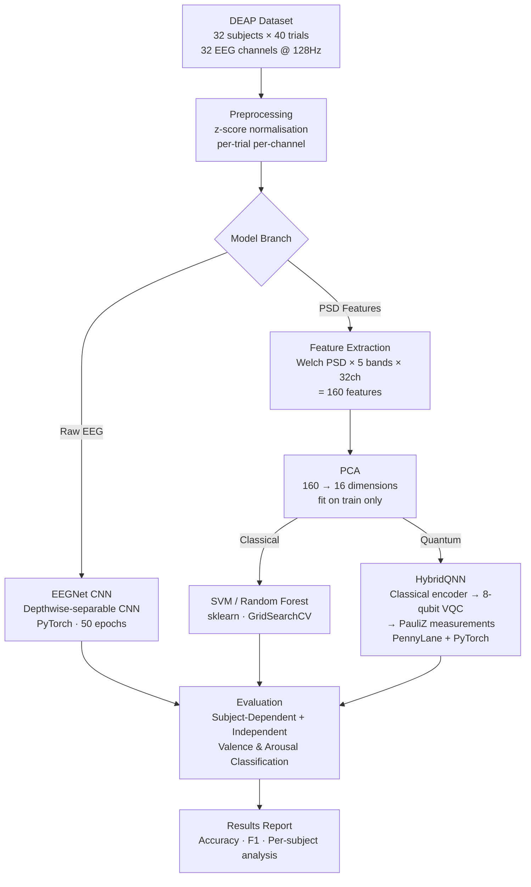

# EEG Emotion Recognition — Hybrid Quantum-Classical Study

[](https://python.org)
[](https://pytorch.org)
[](https://pennylane.ai)
[](https://scikit-learn.org)
[](LICENSE)
[](https://www.eecs.qmul.ac.uk/mmv/datasets/deap/)

A comparative study of four models — **SVM**, **Random Forest**, **EEGNet** (CNN), and a **Hybrid Quantum-Classical Neural Network (HybridQNN)** — for EEG-based valence and arousal classification on the DEAP dataset.

The pipeline evaluates all models under two realistic protocols:
- **Subject-Dependent** — standard 70/10/20 stratified split
- **Subject-Independent** — held-out participants to measure cross-subject generalisation

---

## Abstract

This project implements and benchmarks a Hybrid Quantum-Classical model for EEG-based emotion recognition. EEG signals from 32 participants (DEAP dataset) are preprocessed and classified into binary valence and arousal labels. Classical baselines (SVM, Random Forest, EEGNet) are compared against a HybridQNN that combines a classical encoder with an 8-qubit variational quantum circuit (PennyLane) followed by a classical output head. Results show the HybridQNN achieves performance competitive with classical baselines on the subject-dependent protocol, though no model dominates universally. The subject-independent results confirm that cross-subject generalisation remains a challenging open problem in EEG emotion recognition.

---

## Research Objective

To investigate whether a hybrid quantum-classical model can match or improve upon classical machine learning baselines for EEG-based emotion classification, and to evaluate generalisation across subjects using a rigorous leave-subjects-out protocol.

---

## Pipeline Architecture



---

## Methodology

### Dataset
- **DEAP** (Database for Emotion Analysis using Physiological signals)
- 32 participants × 40 video trials = **1,280 trials**
- 32 EEG channels, 128 Hz sampling rate, 63 seconds per trial
- Binary labels: **valence** (positive vs. negative) and **arousal** (high vs. low) — threshold at rating ≥ 5

### Preprocessing
- Per-trial, per-channel z-score normalisation
- DEAP data is already band-pass filtered (4–45 Hz)

### Feature Extraction (SVM / RF / HybridQNN)
- Welch PSD power in 5 frequency bands × 32 channels = **160 features**
- Reduced to **16 dimensions** via PCA (fit on train only — no leakage)

### EEGNet
- Consumes raw EEG time-series directly
- Depthwise-separable CNN architecture (PyTorch)
- 50 training epochs with best-validation checkpointing

### Hybrid Quantum-Classical Model (HybridQNN)
```
Input (16 PCA features)
  → Linear(16 → 8) + ReLU          [classical encoder]
  → tanh × π  (bound to [-π, π])
  → AngleEmbedding on 8 qubits      [quantum feature encoding]
  → 2 × (Rot gates + CNOT ring)     [variational quantum circuit]
  → <Z> measurements on 8 qubits    [expectation values]
  → Linear(8 → 2)                   [classical output head]
```
- Framework: **PennyLane** `default.qubit` statevector simulator + **PyTorch** autograd
- 30 training epochs with best-validation checkpointing

---

## Results Summary

### Subject-Dependent Protocol

| Model | Valence Acc % | Arousal Acc % | Mean Acc % |
|---|---|---|---|
| SVM | 56.25 | 62.89 | 59.57 |
| Random Forest | 61.72 | 61.33 | 61.52 |
| EEGNet | 54.69 | 60.16 | 57.42 |
| **HybridQNN** | **55.86** | **61.33** | **58.59** |

### Subject-Independent Protocol

| Model | Valence Acc % | Arousal Acc % | Mean Acc % |
|---|---|---|---|
| SVM | 50.42 | 59.58 | 55.00 |
| Random Forest | 45.83 | 57.50 | 51.66 |
| EEGNet | 49.17 | 57.08 | 53.12 |
| **HybridQNN** | **59.58** | **52.08** | **55.83** |

> **Note:** The HybridQNN valence result under the subject-independent protocol collapsed to a single-class predictor (recall = 100%). Reported differences between models are modest and should be interpreted as broadly comparable rather than decisive rankings.

### Generalisation Gap (Subject-Dependent − Subject-Independent)

| Model | Gap |
|---|---|
| SVM | +4.57% |
| Random Forest | +9.86% |
| EEGNet | +4.30% |
| HybridQNN | +2.77% (inflated — see note above) |

---

## Result Plots

All plots are in the `results/` folder.

| Plot | Description |
|---|---|
| `comparison_subject_dependent.png` | Bar chart comparing all 4 models on the subject-dependent protocol |
| `comparison_subject_independent.png` | Bar chart comparing all 4 models on the subject-independent protocol |
| `generalization_gap.png` | Visualises the drop from subject-dependent to subject-independent accuracy |
| `roc_subject_dependent_*.png` | Combined ROC curves for all models per task/protocol |
| `cm_subject_*_*.png` | Confusion matrices per model/task/protocol |
| `training_subject_*_*.png` | Training and validation loss/accuracy curves (EEGNet & HybridQNN) |

---

## Installation

### 1. Clone the repository
```bash
git clone https://github.com/thanujaa-5520/eeg-emotion-recognition-qml.git
cd eeg-emotion-recognition-qml
```

### 2. Create a virtual environment (recommended)
```bash
python -m venv venv
# Windows:
venv\Scripts\activate
# macOS/Linux:
source venv/bin/activate
```

### 3. Install dependencies
```bash
pip install -r requirements.txt
```

### 4. Download the DEAP dataset
The DEAP dataset must be requested and downloaded separately (it is not included in this repo due to its size — ~3.1 GB):
1. Register at: https://www.eecs.qmul.ac.uk/mmv/datasets/deap/
2. Download the per-subject `.dat` files (`s01.dat` … `s32.dat`)
3. Place all `.dat` files inside the `data/` folder

> **No dataset?** The pipeline auto-generates synthetic demo data if `data/` is empty, so you can verify the full pipeline end-to-end without the real data.

---

## How to Run

### Full training pipeline
```bash
python main.py
```
This trains all 4 models (SVM, RF, EEGNet, HybridQNN) under both protocols and generates all result plots and the report in `results/`.

### Resume after interruption
The pipeline is crash-resilient. If it stops mid-run, simply re-run:
```bash
python main.py
```
It will skip already-completed runs and continue from where it left off.

### Start fresh (ignore previous progress)
```bash
EEG_QML_FRESH=1 python main.py        # macOS / Linux
$env:EEG_QML_FRESH=1; python main.py  # Windows PowerShell
```

### Quick smoke test (fast end-to-end check)
```bash
EEG_QML_QUICK=1 python main.py        # macOS / Linux
$env:EEG_QML_QUICK=1; python main.py  # Windows PowerShell
```

### Regenerate report from existing results (no re-training)
```bash
python regenerate_report.py
```

### Phase 1 validation
```bash
python phase1_validation.py
```

---

## Reproducibility

- Global random seed: **42** (Python, NumPy, PyTorch)
- PCA and StandardScaler are fit on the training split only
- The same train/val/test split is reused across all four models within a protocol
- Quantum circuit executed on `default.qubit` statevector simulator (deterministic, no shot noise)
- Subject-Independent split — Train: subjects 0–4, 6, 8–9, 11–17, 20–21, 23–25, 29–30; Val: 5, 10, 22, 28; Test: 7, 18–19, 26–27, 31

---

## Citation

If you use this code, please cite:

```
Thanujaa TSK (2026). EEG Emotion Recognition — Hybrid Quantum-Classical Study.
GitHub: https://github.com/thanujaa-5520/eeg-emotion-recognition-qml
```

DEAP Dataset:
```
Koelstra, S. et al. (2012). DEAP: A Database for Emotion Analysis Using Physiological Signals.
IEEE Transactions on Affective Computing, 3(1), 18–31.
```

---

## Author

**Thanujaa TSK**
B.Tech CSE — VIT Chennai
Registration No: 24BCE5520
GitHub: [@thanujaa-5520](https://github.com/thanujaa-5520)

---

## License

This project is licensed under the MIT License — see [LICENSE](LICENSE) for details.
